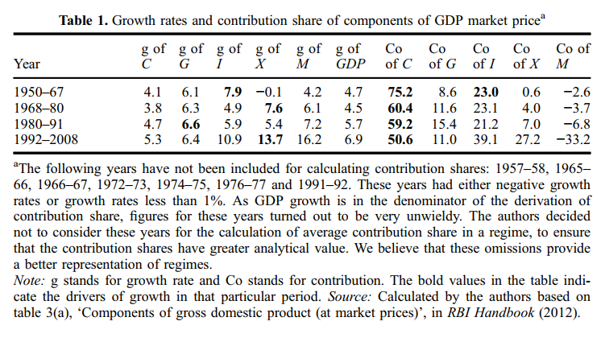
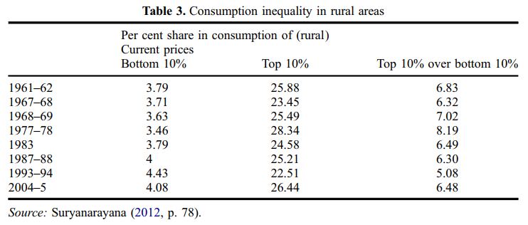
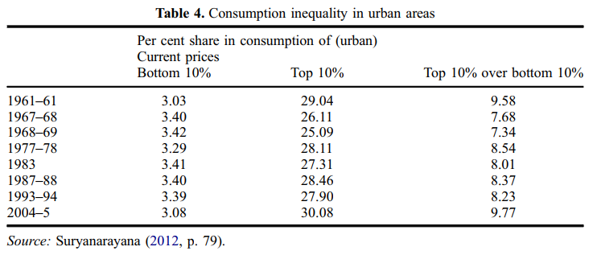

## Reference

Vamsi Vakulabharanam & Rahul De (2016) [Growth and Distribution Regimes in India after Independence](vamsi.pdf), The Round Table, 105:6, 621-640, DOI: 10.1080/00358533.2016.1246860

## Introduction

- Two narratives of post colonial economic development
  - Macro indicators
  - Succession of regimes

- Both the narratives are important.

# The four regimes of accumulation in Independent India (1947-2011)

## India on the Eve of Independence

- Destroyed traditional industries
- Deindustrialised the country.
- Left the country with challenges:
  - Self sufficiency in agriculture
  - Heterogeneous groups and their vested interests
  - Technological dependence on the metropolitan economies.
  
---

**1: Pre-eminence of Planning and State Capitalism (1950-67)**

- Economy under Nehru
  - State directed
  - Emphasis on heavy industries
- Growth of industry - 5.8%
  - Government consumption (G) - 6%
- State as the main driver of growth.
- Investment in industry - 7%
- Dual role of public investment.
- Resources allocated to long-term industrial investments.

---

**1: Pre-eminence of Planning and State Capitalism (1950-67)**

- Import Substitution Regime
  - To protect infant domestic industries.
  - To increase exports.

- Exports growth = 1%
- Imports were still higher
  - India's dependence for food, energy, and machinery.
  - Imports grew by 40%.
  - Current Account Deficit peaked to 3% by 1965.
  - More foreign aid needed to finance CAD.

---

**1: Pre-eminence of Planning and State Capitalism (1950-67) : Class Dynamics & Distributional Effects**

- Benefits to domestic capital
  - Limited expansion of public sector
  - Domestic capital protected from external competition.

- Benefits to urban skilled workers
- Unsuccessful *land to tiller* policy
  - Land redistribution blocked by large landlords
  - Limited redistribution

- Low growth in agriculture

---

**1: Pre-eminence of Planning and State Capitalism (1950-67) : Class Dynamics & Distributional Effects**

- Greater urban-rural inequality
- Absence of welfare policy
- State $\rightarrow$ GDP growth; Economic Planning $\rightarrow$ Distribution

---

**1: Pre-eminence of Planning and State Capitalism (1950-67) : Class Dynamics & Distributional Effects**

- Urban & rural consumption inequality declined

---

**Crisis towards the mid 1960s**

- Imbalances in agriculture sector.
- Inadequate public investment
- Failure of land reforms
- Growth of agri sector: 1.7%
- Structural imbalances led to BoP crisis in 1965 and 1966

---

**Crisis towards the mid 1960s**

- BoP crisis
  - Lack of monsoon
  - Fall in agri output (10%)
  - Fall in private consumption
  - Import of food grains increased in 1966
- Imports $\uparrow$  11% in 1965 $\rightarrow$ 28% in 1966
  - Led to BoP crisis
  - Pressures to devalue
  - Bring down the import substitution regime.
  

---

**2: Green revolution and populism (1967-80)**

- Agricultural crisis $\rightarrow$ Change in policy (land reform)
- The New Agricultural Strategy (1965)
  - Improve productivity
    - Technological modernisation
  - Investments
    - Crop wise and region wise
- Shift from public to private sector investments

---

**2: Green revolution and populism (1967-80)**

- State's role
  - Increased agri credit & fertilizer subsidies
  - Increased mechanisation
  - Support minimum prices
  
  
---

---

**2: Green revolution and populism (1967-80)**

- Role of the state in industrial development declined.
- Industrial slackening $\rightarrow$ GDP $\downarrow$ 4.5%
- Exports $\uparrow$ 7.5%
- Increase in government regulation of private and foreign enterprises
  - FERA, 1973
  - MRTP, 1969
  - Nationalisation of banks
- External policy
  - Improve current account
  - Decrease dependence on external powers.
- 1973: Positive CAD in India for the first time.

---

**2: Green revolution and populism (1967-80): Class dynamics and distributional effects**

- Growth of certain crops and regions under Green Revolution.
- Large landholders and the *rural elite* benefited the most.

  

---

**2: Green revolution and populism (1967-80): Class dynamics and distributional effects**

- *Rural rich* emerged $\rightarrow$ increased powers $\rightarrow$ formation of Interest Groups (politically motivated).
  - For instance Lok Dal (led by Charan Singh) that would go on to dethrone Congress in 1978.

- Subsidies $\uparrow$ $\rightarrow$ public investment in industries $\downarrow$
- Green revolution $\rightarrow$ rural inequality
  - Compensatory policies: *Garibi hatao*
- 1070s:
  - PDS
  - IRDP
- Poverty declined from 50% to 40%

---

Rural inequality (1967-80)

---

Urban inequality (1967-80)

---

**Looming Crisis of the 1970s**

- In 1971 crisis developed due to
  - Decline in public investment $\rightarrow$ Decline in private corporate investments
  - Change in the expenditure patterns
    - Capital expenditure to revenue expenditure
    - Increased expenditure funded by 
      - raising fiscal deficit
      - increased external commercial borrowings (ECB)
  - Collapse of the ISI regime (beginning of 1980s)
See [Table 1](slides/Table1.PNG)

  

