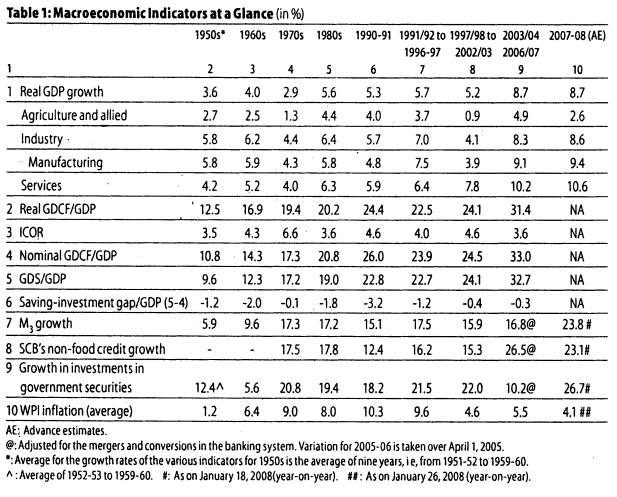

## Reference
[Growth Record of the Indian Economy, 1950-2008: A Story of Sustained Savings and Investment](slides/rakeshmohan.pdf) by **Rakesh Mohan, 2008**, Economic and Political Weekly.

## Introduction
- Review of macroeconomic performance in India since independence.
- India's growth has been largely enabled by the availability of domestic savings, which has increased steadily over the decades.
- High efficiency of resource use with a long term incremental capital-output ratio of around 4 (comparably best in the world).
- Private investment and corporate growth have been the major factors in the recent growth upsurge. Public investment has seen a steady decline during this period.
- Revival of public investment, along with higher public savings would be required to expand public services.

## Growth acceleration over the decades.

- Indian economy witnessed near stagnation in real GDP growth till the late 1970s.
- Growth of manufacturing products in terms of decadal averages was constant around 5.6-5.9% in the first five decades after independence.
- Agricultural growth has been subject to large variations over the decades.
- A glance at the growth records suggest that it is the continuing and consistent acceleration in growth in services that had earlier been ignored, that really accounts for the continuous acceleration in the overall GDP growth but except for the 1970s.
- The slowdown of growth during the 1970s was reversed during the 1980s due to the reforms aimed at increasing domestic competitiveness.

---

---

- Growth impulses gathered further momentum since the early 1990s.
- There was a loss of growth momentum during the latter half of the 90s due to the onset of east Asian financial crisis which had a setback on the fiscal correction process, quality of fiscal adjustment, slowdown in agricultural growth affected by lower than normal monsoon years, and some slackening in the pace of structural reforms.
- The slowdown could also be attributed to the excessive enthusiasm in the investment plans in domestic industry following deregulation.

---

- Monetary tightening in the face of inflationary pressures is also believed to have contributed to the slowdown.
- Since 2003-04, there has been a distinct strengthening of the growth momentum. 
- Restructuring measures by domestic industry, overall reduction in domestic interest rates, both nominal and real, improved corporate profitability, a benign investment climate amidst strong global demand have led real GDP growth averaging close to 9% per annum over the four year period ended 2006-07. 

## Consistent growth in Savings and Investment
- Various scholars have tried to identify the turning point from the traditional low growth to the modern growth since the 1980s.
- The simple ordering of data shows continued slow acceleration in growth except for the 1970s decade.
- The continued acceleration was mainly due to consistent trends of increasing domestic savings and investment over the decades.
- Gross Domestic Savings have increased continuously from an average of 9.6% of GDP during the 1950s to almost 35% during 20006-07.

---

- Over the same period domestic investment rate has also increased continuously from 10.8% in 1950s to close to 36% in 2006-07.
- An important feature is that Indian economic growth has been financed by domestic savings.
- The long term upward trends in savings and investment have been interspersed with phases of stagnation.
- During the 1980s, the inability of government revenues to keep pace with the growing expenditure resulted in widening of the overall resource gap.
- The public sector saving-investment gap which averaged (-)3.7% of GDP during the period 1950-51 to 1979-80 widened sharply during the 1980s leading to a high of (-)8.2% of GDP in 1990-91.

---

- As fiscal deficits widened begining in the 1970s, periodic increases in the statutory liquidity ratio (SLR) were resorted to finance the rising fiscal gap, indicative of the financial repression regime in place.
- The SLR was raised from 20% in the early 1950s to 25% by 1964.
- Beginning in the 1970s, the SLR came to be used more actively and it was raised in phases reaching 34% by the late 70s.
- The process continued during the 80s as fiscal deficits expanded further, and the SLR reached a high of 38.5%.
- The growing fiscal imbalances of the 80s spilled over to the external sector (large and unsustainable current account deficit) and were also reflected in inflationary pressures.

---

- As the financing of such a large current account deficit through normal sources of finance became increasingly difficult it resulted in an unprecedented external payments crisis in 1991 with the foreign currency assets dwindling to less than $\$1$ billion.
- The financing problem was aggravated by the fact that the deficit was largely financed by debt flows up to the late 1980s.

## Growing fiscal Imbalance and correction
- The increase in SLR was unable to meet fully the fiscal requirements.
- The RBI intervened to increase the cash reserve requirements (CRR).
- The CRR was raised from 6% in 1979 to its peak of 15% by 1992. 
- However, even this order of increase in the CRR to impound liquidity was insufficient which led to inflation.
- In response to the balance of payments crisis, a programme of macroeconomic stabilisation and structural adjustment was put in place.
- Fiscal consolidation constituted a major plank of the policy response to the macroeconomic crisis.
- The progress on fiscal correction was mixed during the 1990s both at the central and state levels (see Chart 1 and Tables 2-3).

---

---

---

---

- While there was some reduction in centre's fiscal deficits up to 1996-97, the process was reversed over the next few years under the impact of the industrial slowdown and the FIfth Pay Commission's (FPC) award.
- A major drag on public finances was the decline in the gross tax-GDP ratio of the central government from 10.3% in 1991-92 to 9.4% in 1996-97 and further to 8.2% in 2001-02.
- The reduction in tax-GDP ratio over this phase can be attributed to the reduction in tax rates. As part of the reform of the taxation system, indirect taxes - excise duties as well as custom duties- were cut substantially from the existing high levels and this had an adverse impact on indirect tax collections.

---

- The compliance response to lower tax rates took some time, and lower economic growth also contributed to the lack of growth in direct taxes over this period.
- By the year 2001-02, all the major fiscal parameters viz, revenue deficit, fiscal deficit, and public debt rose to levels higher than those prevalent at the beginning of the reform process.
- Reflecting the worsening of the fiscal situation, the public sector savings rate deteriorated in the second half of the the 1990s. This also pulled down the aggregate savings and investment rates in the economy.

## Public Sector Savings
- In view of deteriorating fiscal deficits and its adverse impact on public investment and growth, a renewed emphasis was laid on improving health of public finances on a durable basis.
- In order to achieve this objective, fiscal consolidation has been guided by the Fiscal Responsibility and Budget Management (FRBM) Act, 2003 at the centre and the state levels.
- Since 2002-03 significant gains have been witnessed in the fiscal consolidation process both at the centre and the states as a result of the implementation of the rule-based fiscal policies.

---

- A amjor factor contributing to the durability of the fiscal consolidation process has been the buoyancy in the revenues accompanied by reprioritisation of expenditure with a focus on outcomes.
- The revenue augmenting strategy encompassed moderating the taxes and broadening the tax rates and tax base through expansion in the scope of taxes, and removal of exemptions.
- Reflecting these measures, the tax-GDP ratio of the country has steadily risen from 8.2% in 2001-02 to 14.1% in 2006-07.
- The fiscal deficit of the centre and the states taken together has declined from 9.9% of GDP in 2001-02 to 6.4% in 2006-07 led by a reduction in revenue deficit from 7% of GDP to 2.1%.
- The savings of the overall public sector improved from (-)0.2% of GDP in 2001-02 to 3.2% of GDP in 2006-07.

## Performance of the Private Corporate Sector
- The corporate sector has responded to increased global competition by improving its productivity and efficiency through increased application of technology.
- The economic reform process has helped greatly in making the policy environment more conducive for more efficient entrepreneurial activity.
- The corporate tax rate was steadily reduced from 45% in 1992-93 to 30% by 2005-06 and was kept stable after that.
- The peak rate of customs duty on non-agricultural goods was reduced gradually from 150% in 1991-92 to 10% in 2007-08.
- Monetary policy contributed to the sustained moderation in inflation leading to a reduction in nominal interest rates.

---

---

- Profits after tax recorded an annual average growth of around 47% per annum over the period 2006-07.
- Profit margins have recorded large gains while the interest burden has witnessed a significant decline.
- The improved corporate financial performance resulted in a more than doubling of the private corporate sector saving rate which has also contributed to the pick-up of overall saving rate.
- From the long-term perspective it is interesting to observe that the rate of savings of the private corporate sector has increased from around 1% in the 1950s, 1.7% in the 1980s and 3.8% in the 1990s, to almost 8% during 2006-07.

## Household Savings.
- A remarkable feature of the Indian macroeconomic story since independence has been the continuous rise in household savings over the decades (Table 7).

---

- This rise has been characterised by a continuing increase in financial savings as a proportion of GDP.
- The spread of financial sector, of bank branches and post office savings and the like helped in mobilising household financial savings.
- Gross financial savings grew from 13.8% of GDP in 2004-5 to 18.3% in 2006-07.
- Thus the widening of S-I gaps of the public and private corporate sectors combined was partly financed from household financial savings and partly by foreign savings.

## Efficiency in the use of resources
- Not only there has been a consistent upward trend in India's investment rate since the 1950s, there is evidence that capital has been employed productively.
Barring the decade of the 1970s, the incremental capital output ratio has hovered around 4, and there are some signs of improvement in domestic productivity during the post-reform period.
- Cross country comparison indicates that ICOR has been the lowest in India. (Table 8)

---

---

- The improvement in the public finances and public financial sector has contributed significantly to the step-up in domestic savings and investment rates since 2002-03 onwards.
- Higher savings and investment rates, in turn, have led to a higher growth trajectory of the Indian economy. It is apparent that fiscal consolidation in the Indian context has led to acceleration of growth.
- The conventional view holds that the fiscal prudence might lead to contraction of domestic demand and growth. However, as the Indian experience suggests, fiscal prudence can lead to higher domestic savings and thus can increase resources for domestic investment.

---

- Reprioritising public expenditures towards public investment and subsidies is important. While subsidies may provide short term benefits, they tend to hinder long term investments as well as encourage inefficiency in the use of resources.
- These issues are important in the context of agricultural development. Public investment in agriculture declined from 3.4% of agricultural GDP during 1976-80 to 2.6% during 2005-06.
- Greater emphasis on stepping up public investment and containment of subsidies, while adhering to fiscal consolidation is likely to pay rich dividends.

## Financial Sector reforms
- The strong demand for credit from the banking sector since 2003-04 has been fueled by strong investment activity.
- In this context, reforms in the financial sector initiated in the early 1990s has played a key role. 
- These reforms included introduction of auctions in government securities, deregulation on interest rates, and reduction in statutory preemption of institutional resources by the government.
- These measures along with developments in the government securities market by making the yield market-determined, formed the backbone of the financial market reforms.

---

- The interest rates were made market-determined and the also the exchange rate.
- The financial sector reforms designed to improve cost efficiency through price signals facilitated the conduct of monetary policy through indirect market-based instruments through improved fiscal-monetary consideration.
- This was further strengthened through the implementation of the FRBM act, 2003 under which the central government targets to eliminate the revenue deficit and reduce the fiscal deficit to 3% of GDP.

---

---

- Overall, these reforms have led to better price discovery in both interest rates and exchange rates, thereby contributing to overall efficiency in financial intermediation.
- Since 2003-04, private investment has also witnessed a large rise (Chart 2). Thus, it is apparent that higher public investment may crowd-in private investment, leading to a virtuous circle.
- In this aspect fiscal consolidation needs to be persevered with so that higher public investment is possible which may further attract larger private investment.
- Since 2003-04 there has been a significant jump in credit growth which could be attributed to the step-up in real GDP growth, decline in interest rates, intensive policy initiatives to improve flow of credit to sectors like agriculture and finally strong demand for rural credit, particularly housing.

---

[Economic terms used in the text](slides/EconomicTerms.docx)

 